# Architecture

Laya Vision is one decision model with three interchangeable backbones. Every branch takes a state (text, and for
the vision branches an image) plus a typed question, runs a single forward pass with no text generation, and
reads one logit per option from a marker token. The decision head, training objective, temperature calibration
and `predict(state, questions)` output schema are shared; what differs is the backbone, the token sequence, and
which token each option is read from.

| Branch | Backbone | Attention | Sequence builder | Option readout | Act-head pooling | Code |
|---|---|---|---|---|---|---|
| BERT (text only) | ModernBERT-large, 28 layers, d=1024 | bidirectional | `laya.common.build_sequence` | `[MASK]` opening each option | `[CLS]` | `laya/common.py`, `laya/agent.py` |
| SmolVLM | SmolVLM-256M-Instruct (SigLIP-B/16 + SmolLM2-135M, 30 layers, d=576) | causal | `laya.vlm.build_vlm_inputs` | `\n` ending each option line | last real token | `laya/vlm.py` |
| SmolVLM, block option attention | same, `option_attention="block"` | causal, except the option block | same | same | same | `laya.vlm.option_block_mask` |
| ModernVBERT | ModernVBERT (SigLIP2 + ModernBERT-150M, 22 layers, d=768) | bidirectional | `laya.vlm._mask_inputs` | `[MASK]` opening each option | `[CLS]` | `laya/vlm.py` (`readout="mask"`) |

All three vision paths use the same Idefics3 image pipeline: one 512-pixel tile per image, patch 16, pixel shuffle
4, so each image costs 64 language-model tokens.

## The whole model

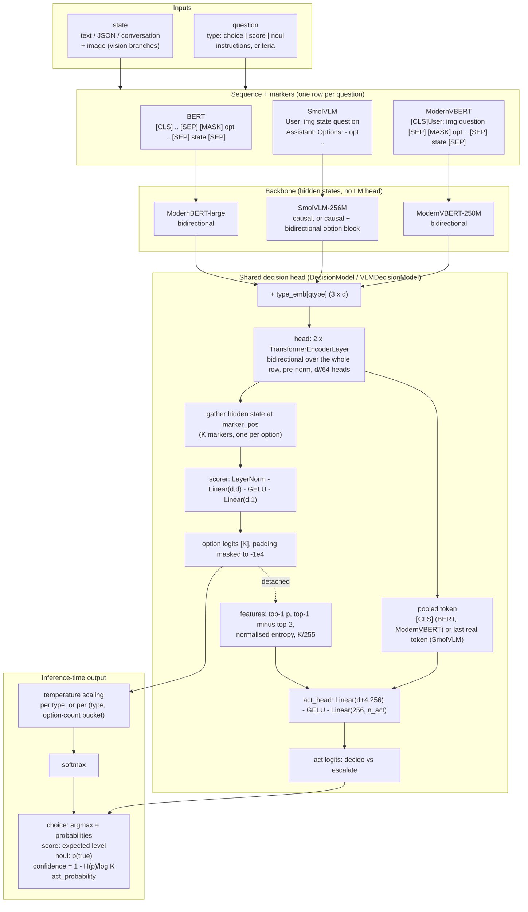

### Training and calibration (all branches)

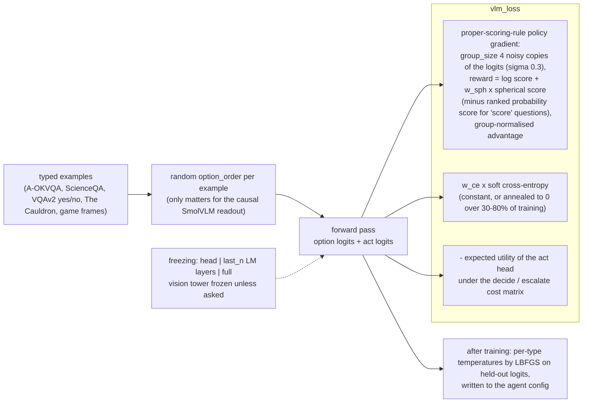

## Branch 1: BERT (Laya's text model)

Upstream Laya. The encoder is ModernBERT-large; the whole sequence is bidirectional, so each option's `[MASK]`
sees the question, every other option and the state. Budgets: question + options within `head_max_len` (192),
the state fills the rest of `max_len` (512).

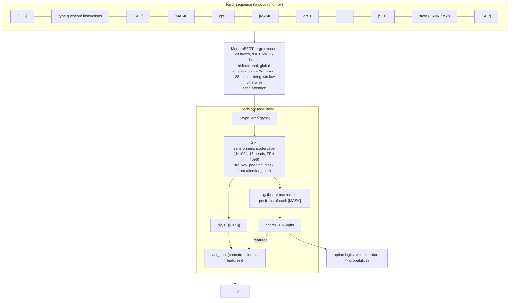

What each `[MASK]` can attend to (bidirectional, so everything):

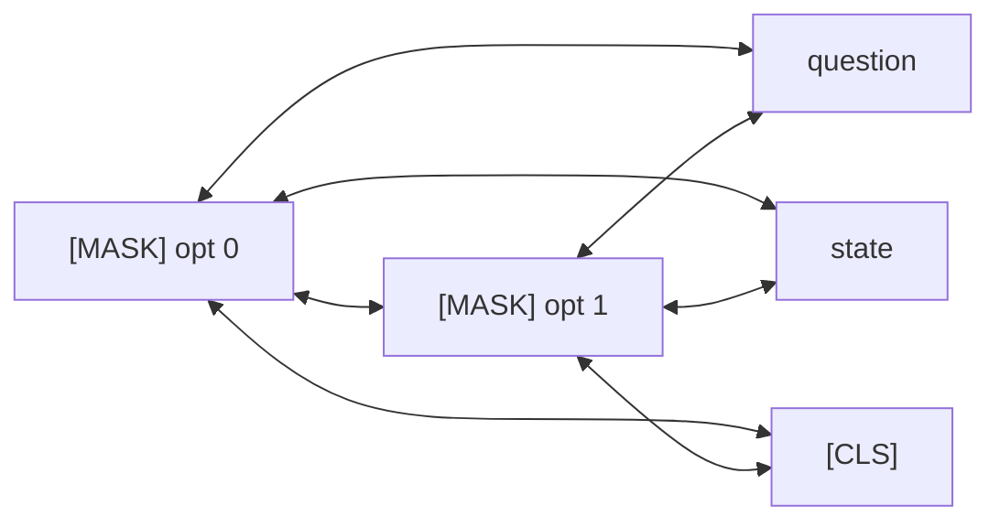

## Branch 2: SmolVLM (causal readout)

`VLMDecisionModel` with `readout="terminator"`. SmolVLM-256M is a decoder, so the options are moved to the end of
the sequence and each option is read at the `\n` that closes its line: the last token of the option span, and the
only token that has seen the image, the state, the question and the option's own text. Using a fixed terminator
gives every readout position the same token identity, the causal analogue of `[MASK]`. Budgets: `max_len` 1024,
`head_max_len` 256.

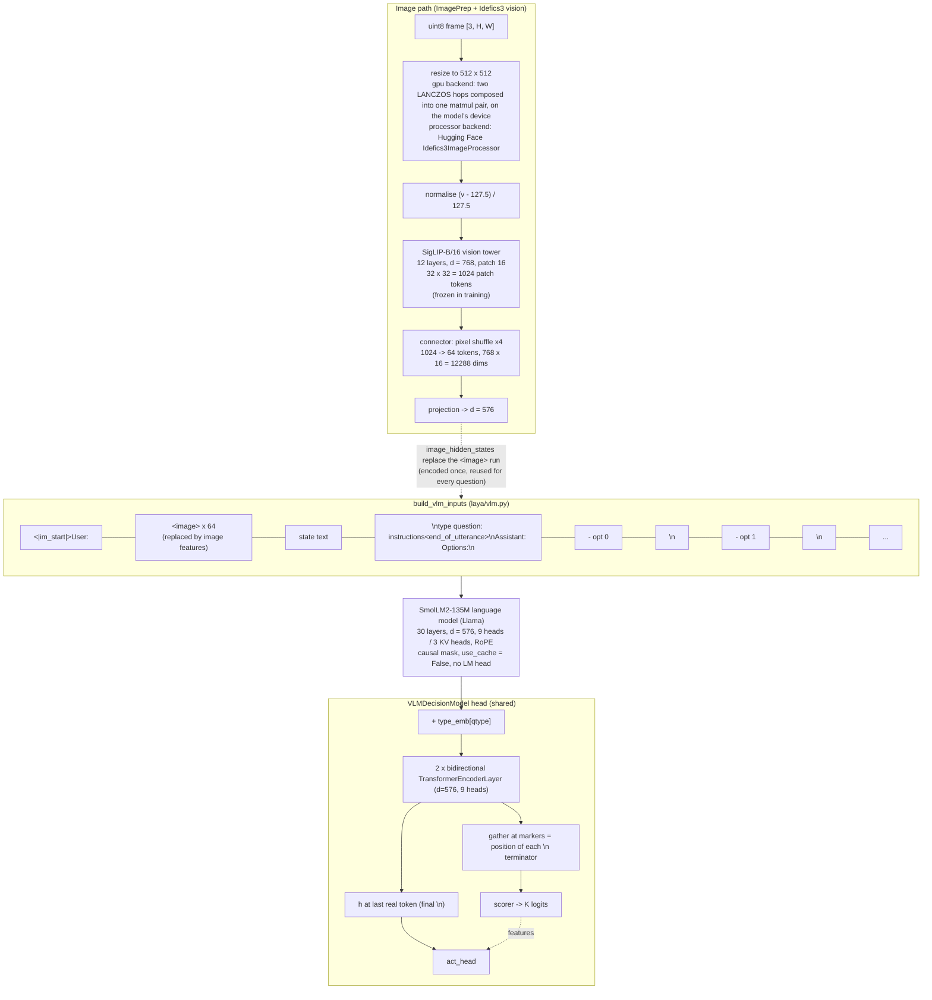

Causal attention means option 0's readout is made without seeing option 1. That is the option-order bias this
branch has to work around: random `option_order` during training, `n_permutations` averaging of logits at
inference, and the bidirectional head layers on top of the backbone.

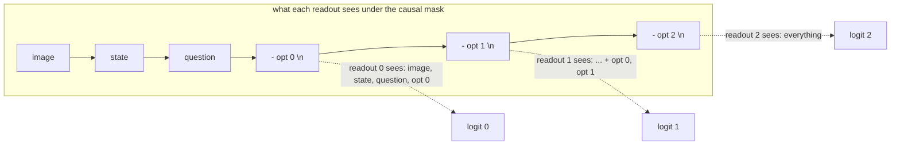

Inference with permutation averaging:

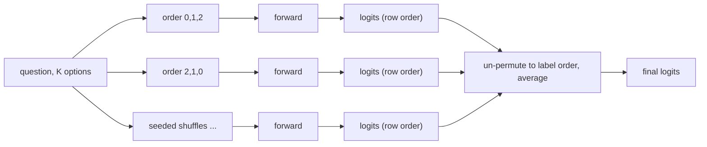

## Branch 3: SmolVLM with block option attention

The same SmolVLM model, sequence and terminator readout, with `option_attention="block"` (formerly `"bidirectional"`, still accepted as a deprecated alias). Instead of the
backbone's default causal mask, `option_block_mask` builds an additive 4D mask that is causal everywhere except
inside the option span, where every option token attends to every other option token in both directions. Each
`\n` readout then sees all competitors, as ModernVBERT's `[MASK]` does, while the image, state and question stay
causal. The pretrained backbone never saw this pattern, so the setting is only meaningful when the language model
is unfrozen (`finetune_long --option-attention block`). It is recorded in `vlm_agent_config.json` and
applied at inference; the `"mask"` readout rejects it.

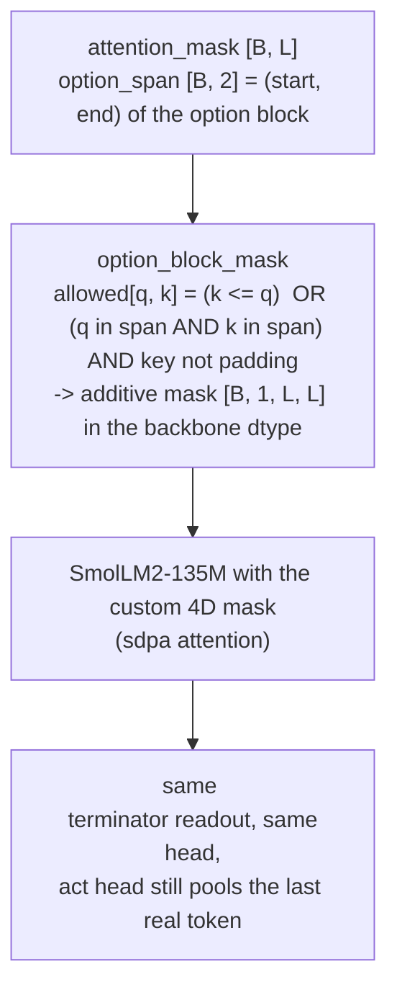

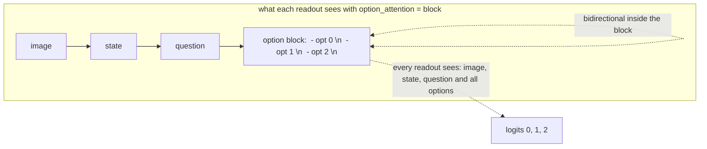

Attention pattern, query rows against key columns (`x` = may attend):

```
keys:        img  state  q   opt0  opt1  opt2
img            x
state          x    x
question       x    x    x
opt0           x    x    x    x     x     x
opt1           x    x    x    x     x     x
opt2           x    x    x    x     x     x
```

### Inference: the shared-prefix cache (Branches 2 and 3)

Every row `VLMAgent.predict` scores for one state (each question, times each option order with
`n_permutations`) begins with the same tokens: the image run and the state text. Under the causal readout those
tokens' hidden states and keys/values do not depend on anything after them, so `predict` computes them once
(`VLMDecisionModel.encode_prefix`: one batch-1 pass through the full backbone, the only pass the image features
are merged into), replicates the key/value cache across the batch, and runs only each row's suffix through the
text model (`forward_prefixed`), with explicit positions `P..` and a 4D mask `[B, 1, S, P + S]` over the prefix
plus suffix keys (`option_block_mask(..., query_start=P)`: every suffix token sees the whole prefix, causal within
the suffix, the option span fully connected under `"block"`, padding keys masked). The cached prefix hidden
states are put back in front of the suffix ones before the head transformer, which is bidirectional over the
whole row, so the head, scorer and act head see exactly the sequence the full path builds.

The shared prefix is the longest common token prefix of all rows (`shared_prefix_len`), not a fixed boundary:
`build_vlm_inputs` cuts the state to the room each question's tail leaves, so with a long state and questions of
different lengths the rows carry different amounts of state and the cache stops where the shortest cut does.
Under causal attention it may also run past the state (one question under several option orders shares its whole
question text); under `"block"` it stops at the first option span, whose tokens attend forward. The image run
must lie inside it, otherwise `predict` takes the full path. The `"mask"` readout (ModernVBERT) always takes the
full path: a bidirectional prefix depends on what follows it.

`predict(..., prefix_cache=None)` decides per call: on a CPU the cache is used whenever there are two or more
rows (the backbone is compute-bound there), on CUDA only when there are more rows than `batch_size`, because a
backbone pass of this size costs about the same at any batch size up to a few thousand tokens and the cache adds
one. `True` forces the cache, `False` the full path. In fp32 the two paths agree to about 1e-6 in the option
logits (`tests/test_vlm.py::test_prefix_cache_matches_full_path`); in bf16 the probabilities differ by up to
0.004, bf16 rounding of a different summation order.

Latency, `modal run modal_app.py::bench_prefix_cache`: NVIDIA L4, bf16, the published checkpoint
(`cauldron-score-2ep-bidir-full/best`, `option_attention="block"`, 512-pixel processor preprocessing), one
640x480 image, 3 questions (a 4-option choice, a 4-level score and a noul, so `n_permutations` 1 / 4 / 8 gives 3 /
10 / 18 rows), `batch_size=8`, median of 20 calls after 3 warm-ups, end to end including preprocessing. "Short
state" is about 30 state tokens (about 140 tokens per row), "long state" about 740 (about 830 per row). Single
runs on a shared cloud GPU; absolute times move by +-30% between containers, the ratios within a run are stable.

| State | `n_permutations` | Rows | Full path | Cache forced | Speedup | Default (`None`) |
|---|---|---|---|---|---|---|
| image + short state | 1 | 3 | 80 ms | 122 ms | 0.66x | 80 ms (full) |
| image + short state | 4 | 10 | 131 ms | 126 ms | 1.04x | 126 ms (cache) |
| image + short state | 8 | 18 | 195 ms | 135 ms | 1.45x | 135 ms (cache) |
| image + long state | 1 | 3 | 87 ms | 130 ms | 0.67x | 88 ms (full) |
| image + long state | 4 | 10 | 207 ms | 161 ms | 1.28x | 158 ms (cache) |
| image + long state | 8 | 18 | 338 ms | 197 ms | 1.72x | 205 ms (cache) |

On the GPU the saving is in backbone passes (the full path runs `ceil(rows / 8)` of them, the cached path one
prefill plus `ceil(rows / 32)` suffix passes) and in tokens once rows are long; at three rows the extra prefill
pass makes the cache a loss, which is why the default skips it there. On a CPU the time follows the token count,
and the cache pays from two rows on: `tests/test_vlm.py::test_prefix_cache_speed` (SmolVLM-256M, fp32, a Modal
container with 4 vCPUs, one 96x96 image with a 5-token caption, the 3 test questions, median of 3) gave 1316 ms
full vs 1182 ms cached (1.11x) at `n_permutations=1` and 2234 ms vs 1566 ms (1.43x) at 4; the prefix there is
only 79 tokens, so a longer state gains more.

## Branch 4: ModernVBERT (bidirectional readout)

`VLMDecisionModel` with `readout="mask"`, picked automatically from the backbone's `model_type`. ModernVBERT is a
bidirectional masked-language-model encoder (ModernBERT-150M) with a SigLIP2 vision tower behind the same
Idefics3 processor SmolVLM uses, so Laya's original text sequence carries over with the image run where the
pretraining chat template puts it. Every `[MASK]` sees the whole sequence, so there is no option-order bias:
`n_permutations` and `option_attention` are accepted and do nothing.

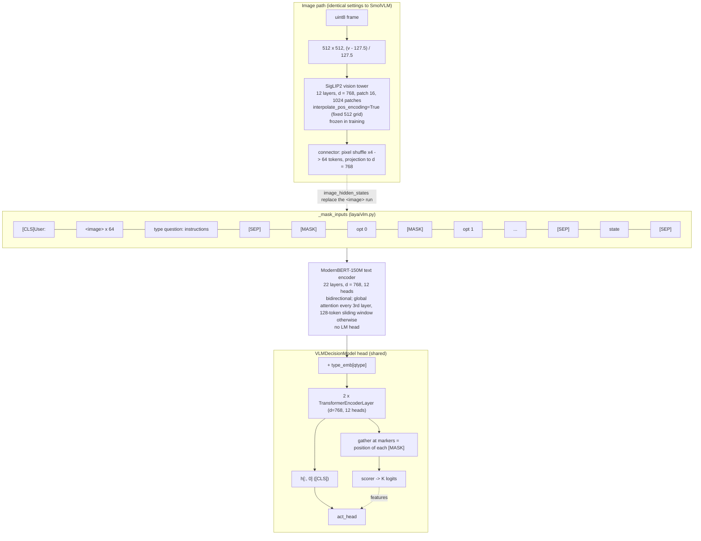

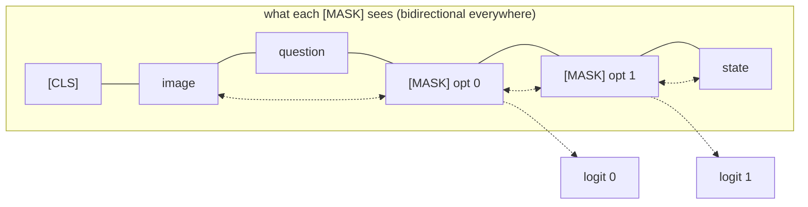

## Side by side: where an option is read

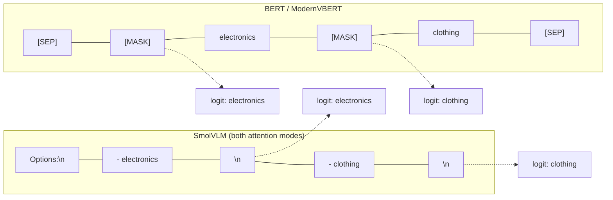

| | BERT | SmolVLM causal | SmolVLM block option attention | ModernVBERT |
|---|---|---|---|---|
| Marker token | `[MASK]` before the option | `\n` after the option | `\n` after the option | `[MASK]` before the option |
| Marker sees other options | all | earlier ones only | all | all |
| Marker sees the state | yes | yes (state precedes options) | yes | yes |
| Order bias mitigation | none needed | random order in training, `n_permutations` at inference | mask, plus the above | none needed |
| Act-head pooling | `[CLS]` | last real token | last real token | `[CLS]` |
| Backbone attention | bidirectional | causal | causal outside the option block | bidirectional |
| Needs backbone fine-tuning to use | no | no | yes | no |

## Checkpoint layout

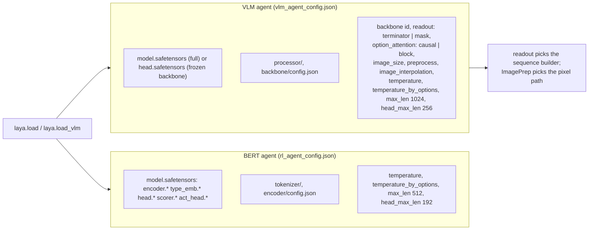
