# Architecture

Laya Vision is one decision model with three interchangeable backbones. Every branch takes a state (text, and for
the vision branches an image) plus a typed question, runs a single forward pass with no text generation, and
reads one logit per option from a marker token. The decision head, training objective, temperature calibration
and `predict(state, questions)` output schema are shared; what differs is the backbone, the token sequence, and
which token each option is read from.

| Branch | Backbone | Attention | Sequence builder | Option readout | Act-head pooling | Code |
|---|---|---|---|---|---|---|
| BERT (text only) | ModernBERT-large, 28 layers, d=1024 | bidirectional | `laya.common.build_sequence` | `[MASK]` opening each option | `[CLS]` | `laya/common.py`, `laya/agent.py` |
| SmolVLM | SmolVLM-256M-Instruct (SigLIP-B/16 + SmolLM2-135M, 30 layers, d=576) | causal | `laya.vlm.build_vlm_inputs` | `\n` ending each option line | last real token | `laya/vlm.py` |
| SmolVLM, bidirectional options | same, `option_attention="bidirectional"` | causal, except the option block | same | same | same | `laya.vlm.option_block_mask` |
| ModernVBERT | ModernVBERT (SigLIP2 + ModernBERT-150M, 22 layers, d=768) | bidirectional | `laya.vlm._mask_inputs` | `[MASK]` opening each option | `[CLS]` | `laya/vlm.py` (`readout="mask"`) |

All three vision paths use the same Idefics3 image pipeline: one 512-pixel tile per image, patch 16, pixel shuffle
4, so each image costs 64 language-model tokens.

## The whole model

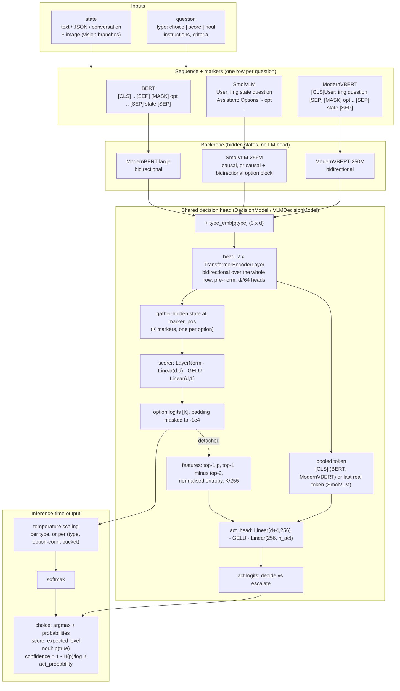

### Training and calibration (all branches)

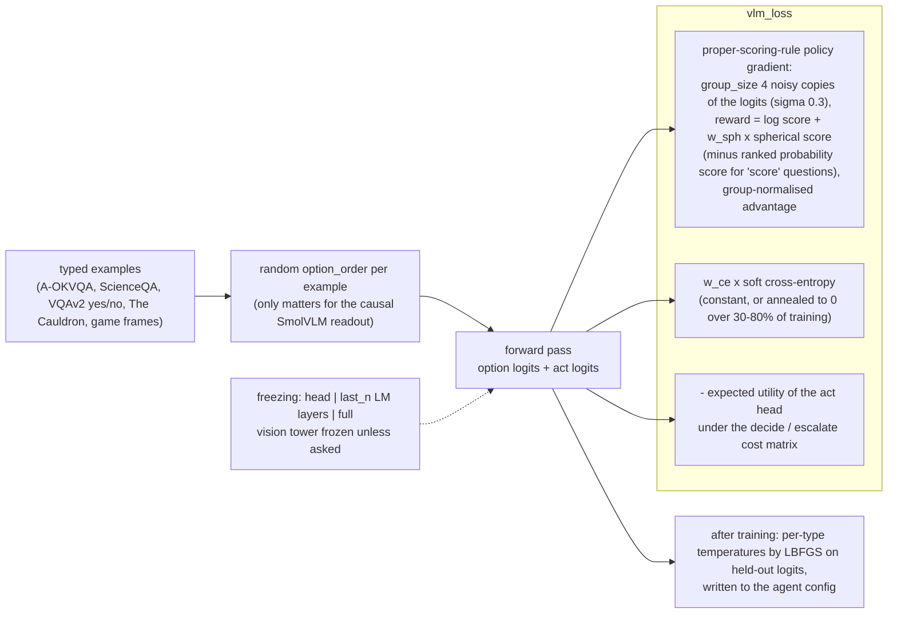

## Branch 1: BERT (Laya's text model)

Upstream Laya. The encoder is ModernBERT-large; the whole sequence is bidirectional, so each option's `[MASK]`
sees the question, every other option and the state. Budgets: question + options within `head_max_len` (192),
the state fills the rest of `max_len` (512).

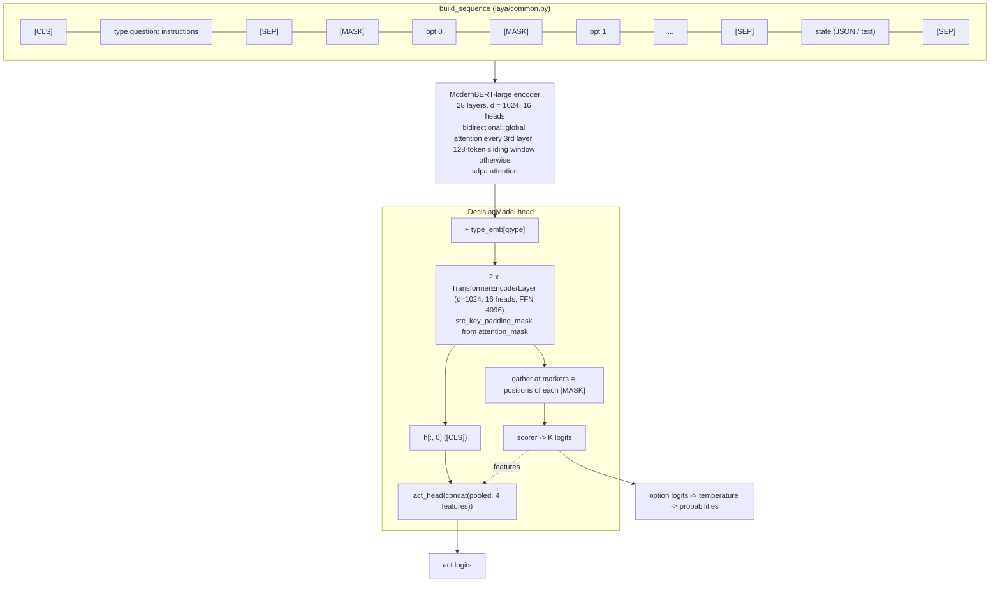

What each `[MASK]` can attend to (bidirectional, so everything):

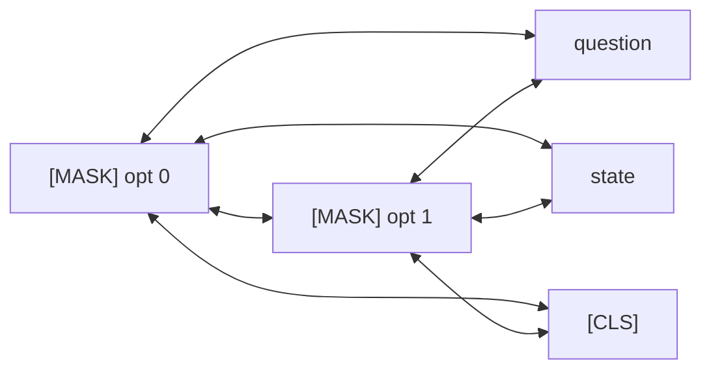

## Branch 2: SmolVLM (causal readout)

`VLMDecisionModel` with `readout="terminator"`. SmolVLM-256M is a decoder, so the options are moved to the end of
the sequence and each option is read at the `\n` that closes its line: the last token of the option span, and the
only token that has seen the image, the state, the question and the option's own text. Using a fixed terminator
gives every readout position the same token identity, the causal analogue of `[MASK]`. Budgets: `max_len` 1024,
`head_max_len` 256.

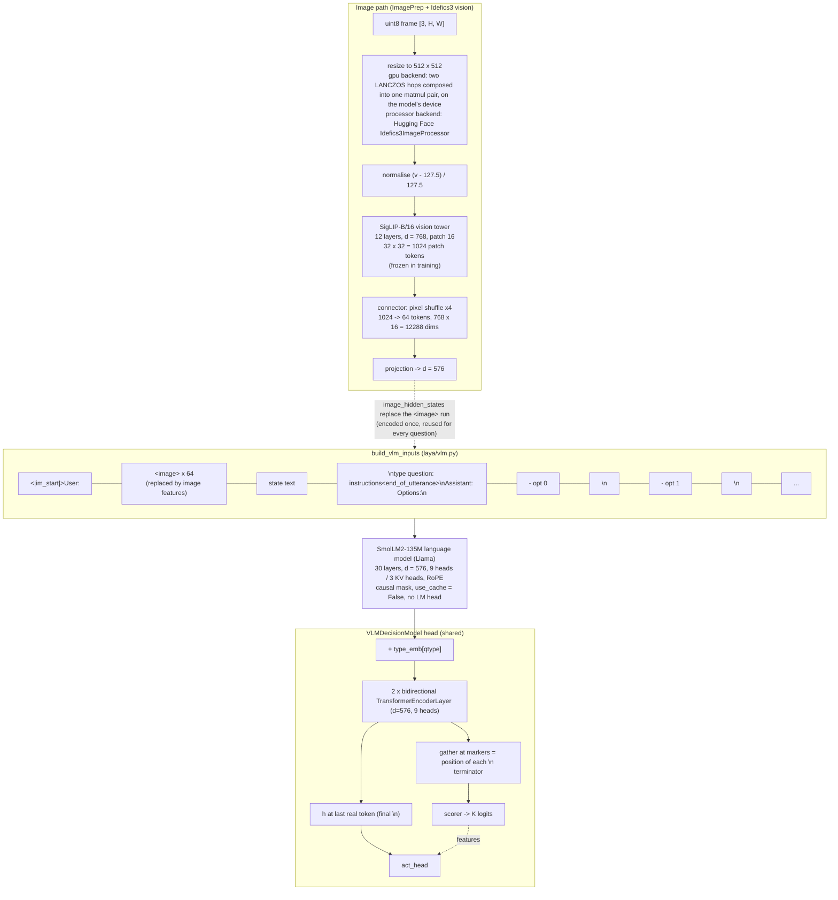

Causal attention means option 0's readout is made without seeing option 1. That is the option-order bias this
branch has to work around: random `option_order` during training, `n_permutations` averaging of logits at
inference, and the bidirectional head layers on top of the backbone.

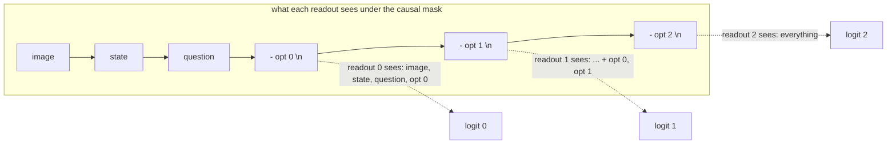

Inference with permutation averaging:

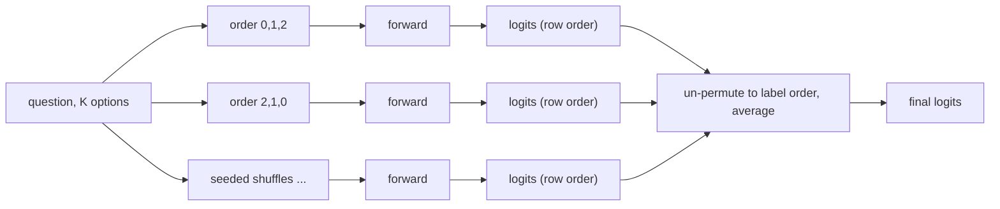

## Branch 3: SmolVLM with bidirectional options

The same SmolVLM model, sequence and terminator readout, with `option_attention="bidirectional"`. Instead of the
backbone's default causal mask, `option_block_mask` builds an additive 4D mask that is causal everywhere except
inside the option span, where every option token attends to every other option token in both directions. Each
`\n` readout then sees all competitors, as ModernVBERT's `[MASK]` does, while the image, state and question stay
causal. The pretrained backbone never saw this pattern, so the setting is only meaningful when the language model
is unfrozen (`finetune_long --option-attention bidirectional`). It is recorded in `vlm_agent_config.json` and
applied at inference; the `"mask"` readout rejects it.

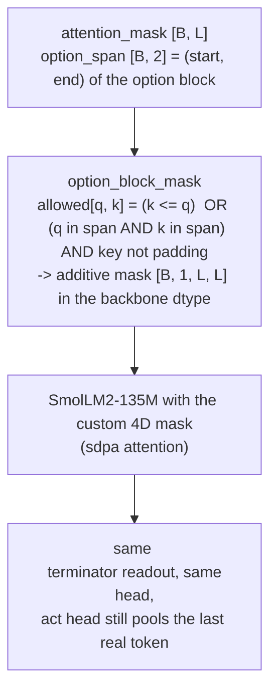

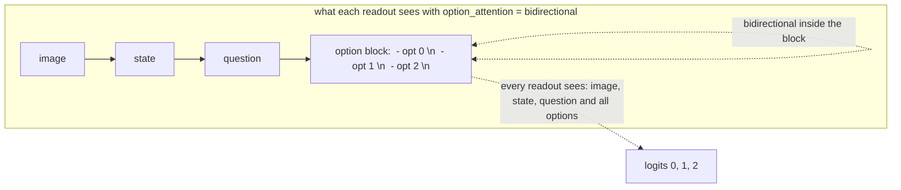

Attention pattern, query rows against key columns (`x` = may attend):

```
keys:        img  state  q   opt0  opt1  opt2
img            x
state          x    x
question       x    x    x
opt0           x    x    x    x     x     x
opt1           x    x    x    x     x     x
opt2           x    x    x    x     x     x
```

## Branch 4: ModernVBERT (bidirectional readout)

`VLMDecisionModel` with `readout="mask"`, picked automatically from the backbone's `model_type`. ModernVBERT is a
bidirectional masked-language-model encoder (ModernBERT-150M) with a SigLIP2 vision tower behind the same
Idefics3 processor SmolVLM uses, so Laya's original text sequence carries over with the image run where the
pretraining chat template puts it. Every `[MASK]` sees the whole sequence, so there is no option-order bias:
`n_permutations` and `option_attention` are accepted and do nothing.

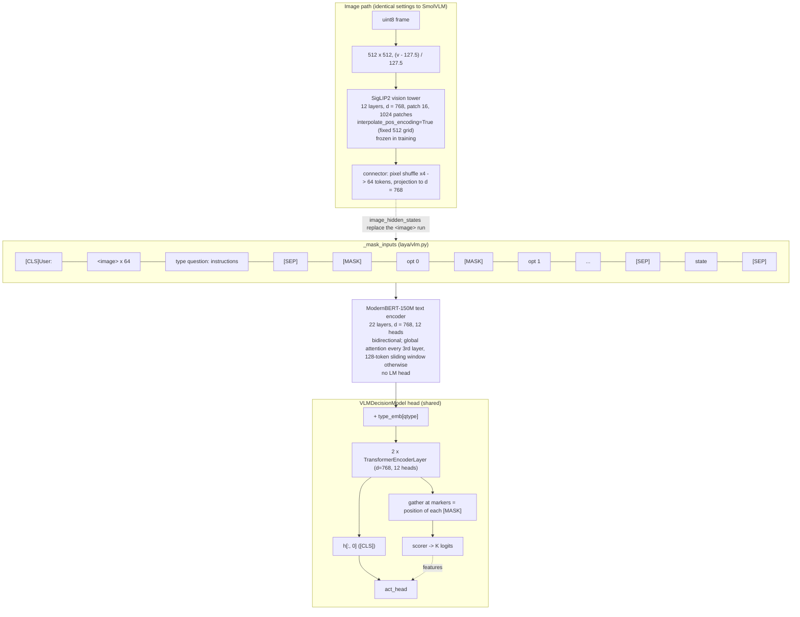

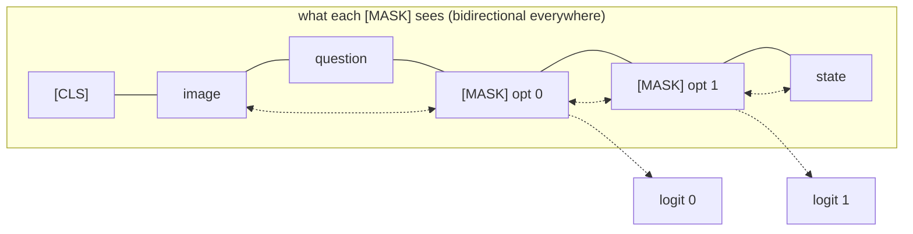

## Side by side: where an option is read

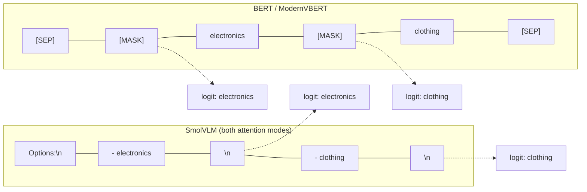

| | BERT | SmolVLM causal | SmolVLM bidirectional options | ModernVBERT |
|---|---|---|---|---|
| Marker token | `[MASK]` before the option | `\n` after the option | `\n` after the option | `[MASK]` before the option |
| Marker sees other options | all | earlier ones only | all | all |
| Marker sees the state | yes | yes (state precedes options) | yes | yes |
| Order bias mitigation | none needed | random order in training, `n_permutations` at inference | mask, plus the above | none needed |
| Act-head pooling | `[CLS]` | last real token | last real token | `[CLS]` |
| Backbone attention | bidirectional | causal | causal outside the option block | bidirectional |
| Needs backbone fine-tuning to use | no | no | yes | no |

## Checkpoint layout


