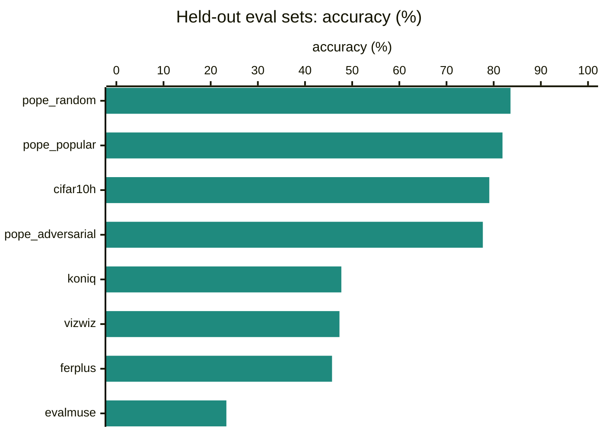
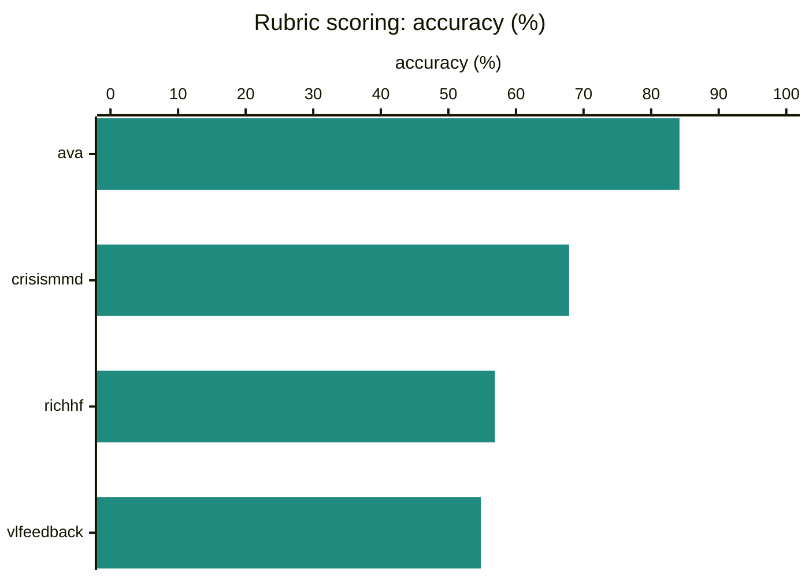
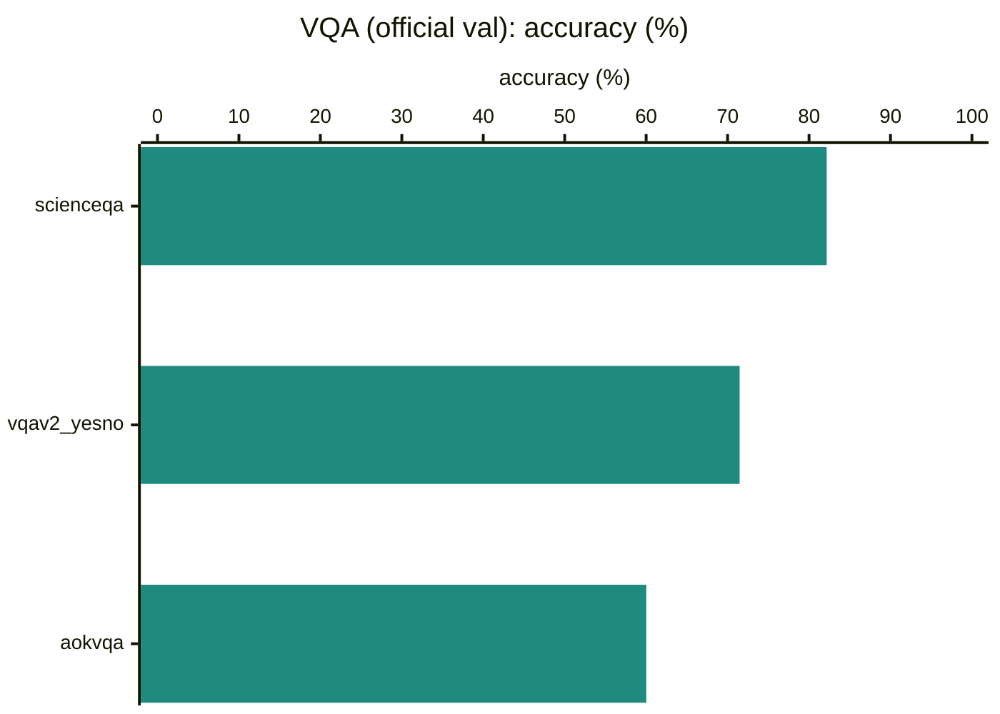
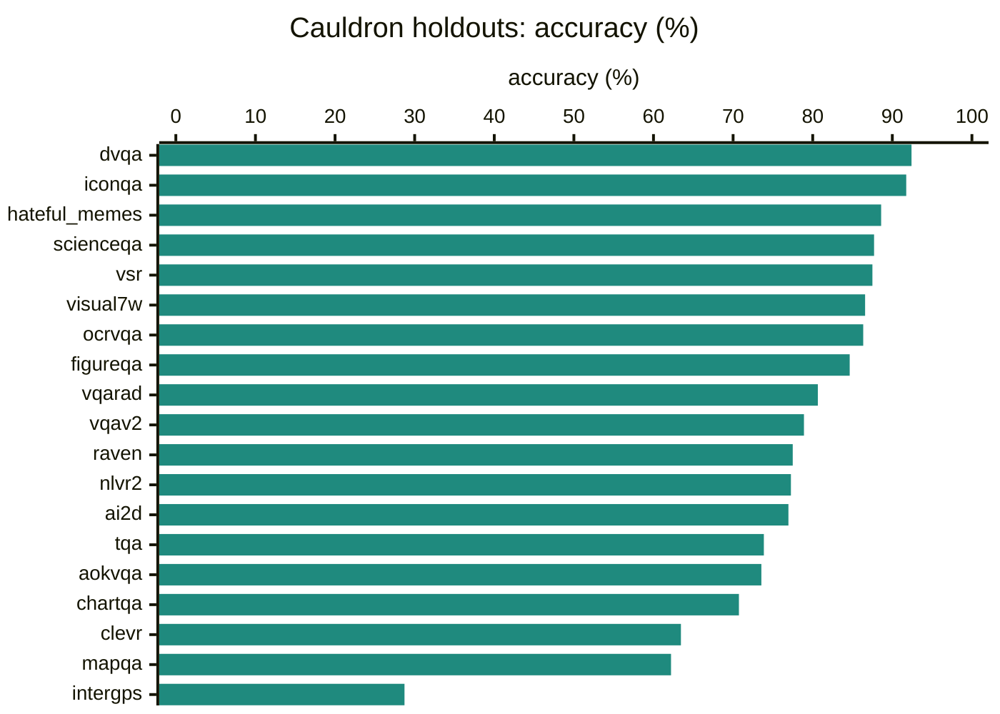
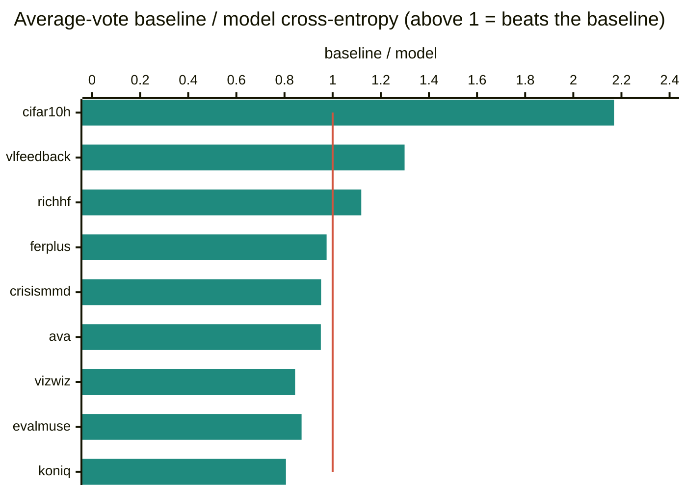
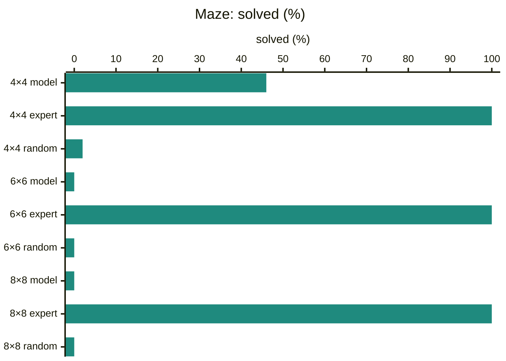
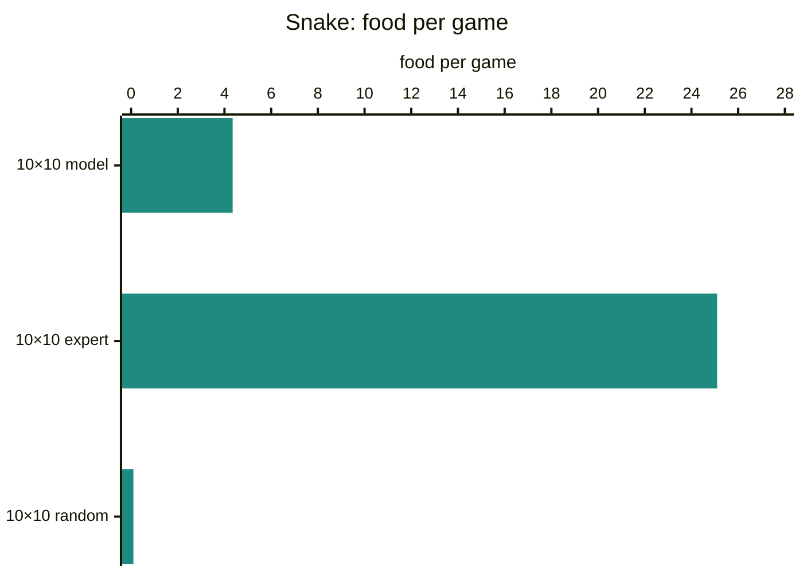
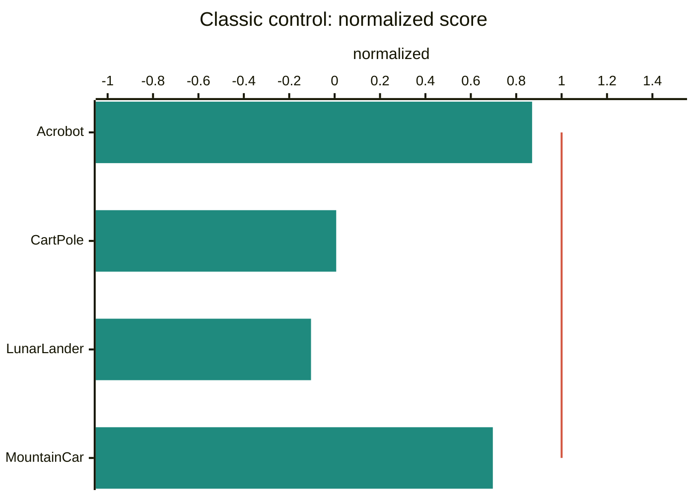

# Laya Vision 201M (autoresearch, 2 h batch 64)

Checkpoint `autoresearch/full/long-sep24-b64/best` · code `claude/eager-thompson-mui6to@e405ed2d` · run 2026-09-24 04:28 UTC · `val` split

Generated by `scripts/eval_report.py` from [`autoresearch-full-long-sep24-b64.json`](../../eval-results/autoresearch-full-long-sep24-b64.json), [`autoresearch-full-long-sep24-b64-latency.json`](../../eval-results/autoresearch-full-long-sep24-b64-latency.json).

> **Errors during the run:** bench_latency: `FileNotFoundError(2, 'No such file or directory')`

## What happened

| | | |
|---|---:|---|
| Pooled accuracy | **69.1%** | 59,427 questions over 34 datasets |
| Calibration error (ECE) | **0.041** | 0 = stated confidence matches accuracy |
| Latency, median | **40.8 ms** | per `predict`, L4, bf16, preprocessing included |

- **note** · Across 34 datasets and 59,427 questions it answers 69.1% correctly (pooled). Best: dvqa at 92.4%; weakest: evalmuse at 23.3%.
- **watch** · Calibration: across all questions, its stated confidence and its actual accuracy differ by 4.1 points on average (ECE 0.041 pooled; under 0.03 means probabilities can be read at face value).
- **watch** · Poorly calibrated on 5 hard-label sets (ECE above 0.10): intergps 0.39, chartqa 0.28, visual7w 0.17, vqarad 0.13, ocrvqa 0.11.
- **weak** · Against human vote spreads it beats the always-predict-the-average baseline on 3 of 9 sets (not on ava, crisismmd, koniq, evalmuse, ferplus, vizwiz). (ECE is not meaningful on these sets: it compares confidence with the single most-voted answer, while the model is trained to spread probability like the voters.)
- **good** · Freeway: scores 23.7 against 0.0 for random play and 34.0 for the expert (normalized 0.70).
- **watch** · Breakout: scores 41.3 against 0.8 for random play and 218.0 for the expert (normalized 0.19).
- **weak** · Galaxian: scores 450.0 against 673.0 for random play (no expert baseline).
- **good** · ViZDoom basic: mean reward 75.8 (expert 75.8, random -121.9), kills in 100.0% of episodes.
- **watch** · Maze: solves 4×4: 46.0%, 6×6: 0.0%, 8×8: 0.0% (the shortest-path expert solves all; random play at most 2.0%).
- **watch** · Snake: eats 4.3 food per game on a 10×10 board (expert 25.1); games end by self 5, starved 1, wall 14.
- **good** · Acrobot: scores -138.7 against -500.0 for random play and -84.6 for the scripted expert (normalized 0.87); solved in 30.0% of episodes.
- **watch** · CartPole: scores 24.4 against 20.9 for random play and 500.0 for the scripted expert (normalized 0.01); solved in 0.0% of episodes.
- **weak** · LunarLander: scores -223.9 against -177.1 for random play and 273.2 for the scripted expert (normalized -0.10); solved in 0.0% of episodes.
- **good** · MountainCar: scores -145.4 against -200.0 for random play and -121.7 for the scripted expert (normalized 0.70); solved in 0.0% of episodes.
- **note** · Latency: 41 ms median per predict call on an L4 in bf16 (p90 46 ms).

## Datasets

Calibrated answers, as `predict` returns them. Accuracy counts the most likely option against the labelled answer; ECE is the gap between stated confidence and accuracy. Sets marked \* are scored against human vote spreads, where accuracy and ECE only see the most-voted answer: read those in [Against human disagreement](#against-human-disagreement).

### Held-out eval sets · mean 60.8%

Sets the model never trained on: photo quality, prompt alignment, CIFAR-10H, facial expressions, VizWiz answerability and POPE hallucination probes.

| dataset | questions | accuracy | ECE | NLL |
|---|---:|---:|---:|---:|
| pope_random | 3,000 | 83.6% | 0.038 | 0.401 |
| pope_popular | 3,000 | 81.9% | 0.047 | 0.429 |
| cifar10h\* | 10,000 | 79.1% | 0.060 | 0.730 |
| pope_adversarial | 3,000 | 77.7% | 0.048 | 0.498 |
| koniq\* | 1,000 | 47.7% | 0.173 | 1.425 |
| vizwiz\* | 4,319 | 47.3% | 0.225 | 0.858 |
| ferplus\* | 3,569 | 45.7% | 0.074 | 1.574 |
| evalmuse\* | 3,134 | 23.3% | 0.243 | 1.745 |

### Rubric scoring · mean 65.9%

Graded-level questions (the score head): response quality, aesthetics, generated-image ratings, damage.

| dataset | questions | accuracy | ECE | NLL |
|---|---:|---:|---:|---:|
| ava\* | 1,000 | 84.2% | 0.484 | 1.079 |
| crisismmd\* | 529 | 67.9% | 0.163 | 0.949 |
| richhf\* | 1,990 | 56.9% | 0.105 | 1.043 |
| vlfeedback\* | 2,000 | 54.8% | 0.144 | 1.201 |

### VQA (official val) · mean 71.2%

The three original post-training sets on their official validation splits.

| dataset | questions | accuracy | ECE | NLL |
|---|---:|---:|---:|---:|
| scienceqa | 2,097 | 82.2% | 0.031 | 0.457 |
| vqav2_yesno | 5,000 | 71.5% | 0.065 | 0.566 |
| aokvqa | 1,138 | 60.0% | 0.089 | 1.003 |

### Cauldron holdouts · mean 77.3%

Held-out rows of the 19 Cauldron subsets the model was post-trained on.

| dataset | questions | accuracy | ECE | NLL |
|---|---:|---:|---:|---:|
| dvqa | 1,397 | 92.4% | 0.069 | 0.206 |
| iconqa | 606 | 91.7% | 0.040 | 0.209 |
| hateful_memes | 456 | 88.6% | 0.052 | 0.278 |
| scienceqa | 301 | 87.7% | 0.065 | 0.285 |
| vsr | 160 | 87.5% | 0.075 | 0.293 |
| visual7w | 1,729 | 86.6% | 0.174 | 0.510 |
| ocrvqa | 996 | 86.3% | 0.108 | 0.394 |
| figureqa | 1,928 | 84.6% | 0.081 | 0.354 |
| vqarad | 62 | 80.6% | 0.126 | 0.515 |
| vqav2 | 1,019 | 78.9% | 0.041 | 0.470 |
| raven | 542 | 77.5% | 0.067 | 0.479 |
| nlvr2 | 906 | 77.3% | 0.055 | 0.486 |
| ai2d | 282 | 77.0% | 0.075 | 0.664 |
| tqa | 264 | 73.9% | 0.073 | 0.698 |
| aokvqa | 552 | 73.6% | 0.047 | 0.727 |
| chartqa | 41 | 70.7% | 0.284 | 0.976 |
| clevr | 1,718 | 63.4% | 0.057 | 0.599 |
| mapqa | 1,598 | 62.2% | 0.015 | 0.562 |
| intergps | 94 | 28.7% | 0.391 | 1.873 |

### Against human disagreement

For sets where every image has many human votes: cross-entropy between the model's probabilities and the vote spread, lower is better, compared with a model that always predicts the dataset's average vote. The chart shows the baseline's cross-entropy divided by the model's: above the red line at 1, the model tracks how people vote on each image better than the average does; below it, worse.

| dataset | model | average vote | difference | levels off |
|---|---:|---:|---:|---:|
| cifar10h | 1.057 | 2.293 | -1.236 better | – |
| vlfeedback | 1.201 | 1.560 | -0.359 better | 0.94 |
| richhf | 1.043 | 1.168 | -0.124 better | 0.55 |
| ferplus | 1.835 | 1.790 | +0.045 worse | – |
| crisismmd | 0.949 | 0.904 | +0.046 worse | 0.41 |
| ava | 1.296 | 1.233 | +0.063 worse | 0.26 |
| vizwiz | 0.818 | 0.691 | +0.127 worse | – |
| evalmuse | 1.741 | 1.516 | +0.225 worse | 0.88 |
| koniq | 1.458 | 1.176 | +0.282 worse | 0.46 |

Temperatures (choice, score, yes/no): 3.857, 2.100, 3.053.

## Games

Each step the screen is the image and the options are the game's buttons; every policy plays the same seeded episodes.

### Atari

Greedy play, 4,500-step cap. Normalized: 0 = random, 1 = expert.

| game | model | random | expert | normalized | most used actions |
|---|---:|---:|---:|---:|---|
| Breakout | 41.3 | 0.8 | 218.0 | 0.19 | FIRE 58%, LEFT 15%, RIGHT 13% |
| Freeway | 23.7 | 0.0 | 34.0 | 0.70 | UP 87%, DOWN 7%, NOOP 5% |
| Galaxian | 450.0 | 673.0 | – | – | RIGHT 48%, FIRE 36%, LEFTFIRE 7% |

### ViZDoom · basic

A kill is +100 and every step costs, so waiting and missing go negative.

| policy | mean reward | kill rate | steps per episode |
|---|---:|---:|---:|
| **model** | 75.8 | 100.0% | 6.8 |
| always attack | -325.6 | 18.0% | 63.0 |
| expert | 75.8 | 100.0% | 6.8 |
| random | -121.9 | 68.0% | 39.4 |

### Maze

Share of mazes solved within 4× the shortest path; efficiency is shortest path over steps taken.

| maze | policy | solved | efficiency | steps per episode |
|---|---|---:|---:|---:|
| 4×4 | **model** | 46.0% | 1.00 | 45.6 |
| 4×4 | expert | 100.0% | 1.00 | 16.1 |
| 4×4 | random | 2.0% | 0.32 | 64.0 |
| 6×6 | **model** | 0.0% | 0.00 | 148.8 |
| 6×6 | expert | 100.0% | 1.00 | 37.2 |
| 6×6 | random | 0.0% | 0.00 | 148.8 |
| 8×8 | **model** | 0.0% | 0.00 | 235.8 |
| 8×8 | expert | 100.0% | 1.00 | 59.0 |
| 8×8 | random | 0.0% | 0.00 | 235.8 |

### Snake

Food eaten per game, and how the games ended.

| board | policy | food per game | best game | steps per game | endings |
|---|---|---:|---:|---:|---|
| 10×10 | **model** | 4.3 | 10 | 39.0 | self 5, starved 1, wall 14 |
| 10×10 | expert | 25.1 | 40 | 214.4 | self 16, wall 4 |
| 10×10 | random | 0.1 | 1 | 14.8 | wall 20 |

### Classic control

Gymnasium CartPole, Acrobot, MountainCar and LunarLander from pixels, greedy; the screen ghosts the previous frame so motion is visible. Normalized: 0 = random, 1 = scripted expert; solved is the share of episodes reaching the environment's solved score.

| game | model | random | expert | normalized | solved | most used actions |
|---|---:|---:|---:|---:|---:|---|
| Acrobot | -138.7 | -500.0 | -84.6 | 0.87 | 30.0% | CLOCKWISE 50%, COUNTERCLOCKWISE 49% |
| CartPole | 24.4 | 20.9 | 500.0 | 0.01 | 0.0% | RIGHT 56%, LEFT 43% |
| LunarLander | -223.9 | -177.1 | 273.2 | -0.10 | 0.0% | MAIN_ENGINE 45%, NOOP 43%, LEFT_ENGINE 8% |
| MountainCar | -145.4 | -200.0 | -121.7 | 0.70 | 0.0% | RIGHT 77%, LEFT 22% |

## Latency

One `predict` call with one question on a real validation image, preprocessing included, on an NVIDIA L4 in bf16: median **40.8 ms**, p90 46.3 ms (n 165, mean views per image 1.0, mean input tokens 130.8).

## Reading the numbers

- **accuracy**: share of questions where the most likely option is the labelled answer.
- **ECE**: expected calibration error, the average gap between stated confidence and accuracy (15 bins). 0.02 means a 70% answer is right about 68–72% of the time.
- **NLL**: negative log-likelihood of the right answer; punishes confident mistakes.
- **cross-entropy against human votes**: how far the model's probabilities are from the vote spread; compare with always predicting the dataset's average vote.
- **levels off**: for rubric scores, how far the model's expected level is from the voters' expected level.
- **normalized** (Atari, classic control): score rescaled so random play is 0 and the expert is 1.
