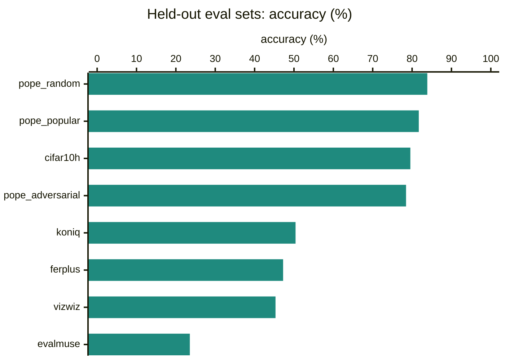
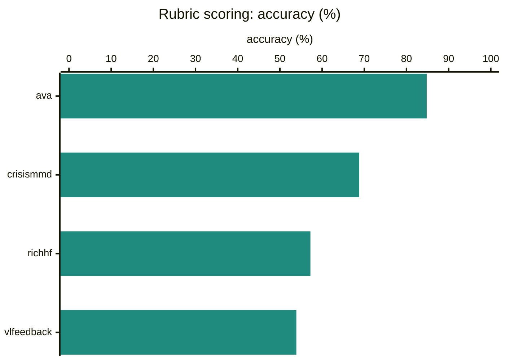
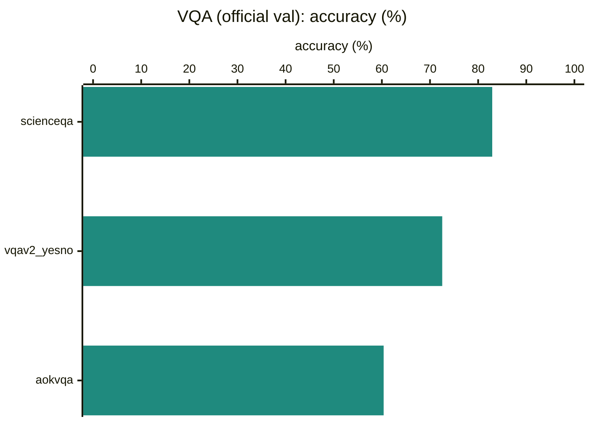
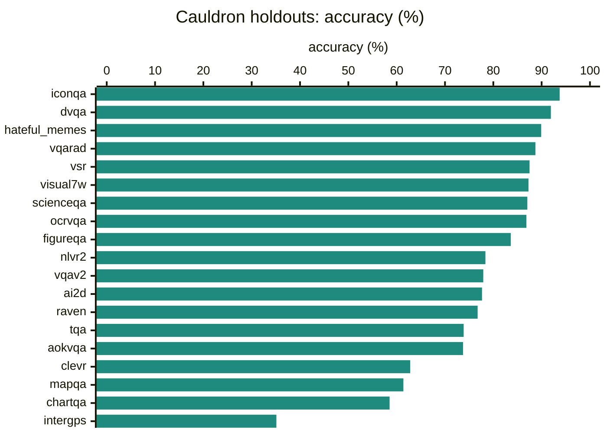
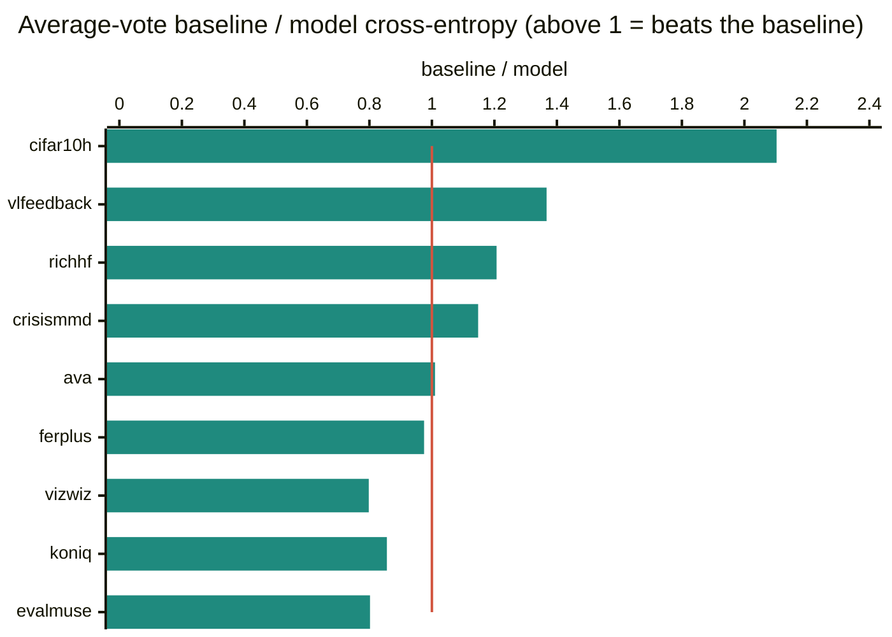
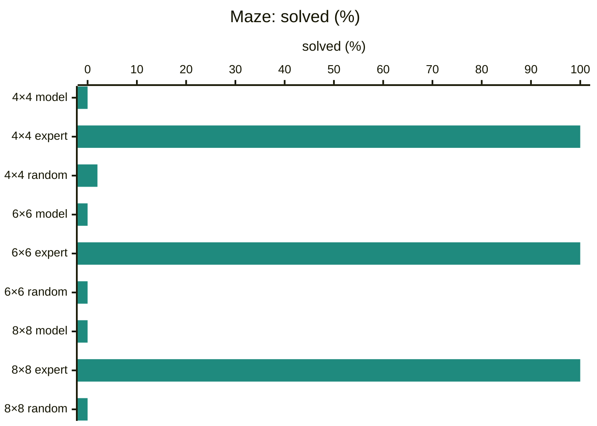
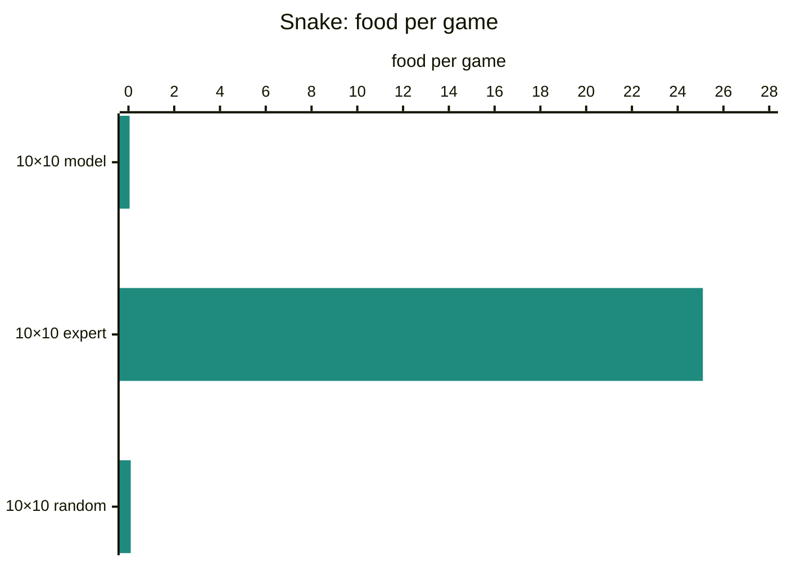

# Laya Vision scorecard

Checkpoint `cauldron-score-2ep-bidir-full/best` · code `claude/eager-thompson-mui6to@5909c427` · run 2026-09-23 01:34 UTC · `val` split

Generated by `scripts/eval_report.py` from [`laya-vision-datasets.json`](../../eval-results/laya-vision-datasets.json), [`laya-vision-games-latency.json`](../../eval-results/laya-vision-games-latency.json).

## What happened

| | | |
|---|---:|---|
| Pooled accuracy | **69.3%** | 59,427 questions over 34 datasets |
| Calibration error (ECE) | **0.064** | 0 = stated confidence matches accuracy |
| Latency, median | **78.6 ms** | per `predict`, L4, bf16, preprocessing included |

- **note** · Across 34 datasets and 59,427 questions it answers 69.3% correctly (pooled). Best: iconqa at 93.7%; weakest: evalmuse at 23.5%.
- **watch** · Calibration: across all questions, its stated confidence and its actual accuracy differ by 6.4 points on average (ECE 0.064 pooled; under 0.03 means probabilities can be read at face value).
- **watch** · Poorly calibrated on 4 hard-label sets (ECE above 0.10): intergps 0.20, aokvqa 0.16, chartqa 0.15, vqarad 0.11.
- **watch** · Against human vote spreads it beats the always-predict-the-average baseline on 5 of 9 sets (not on koniq, evalmuse, ferplus, vizwiz). (ECE is not meaningful on these sets: it compares confidence with the single most-voted answer, while the model is trained to spread probability like the voters.)
- **good** · Freeway: scores 21.0 against 0.0 for random play and 34.0 for the expert (normalized 0.62).
- **watch** · Breakout: scores 1.3 against 0.8 for random play and 218.0 for the expert (normalized 0.00).
- **weak** · Galaxian: scores 643.3 against 673.0 for random play (no expert baseline).
- **weak** · ViZDoom basic: mean reward -325.6 (expert 75.8, random -121.9), kills in 18.0% of episodes. Identical to always pressing attack.
- **weak** · Maze: solves 4×4: 0.0%, 6×6: 0.0%, 8×8: 0.0% (the shortest-path expert solves all; random play at most 2.0%).
- **weak** · Snake: eats 0.1 food per game on a 10×10 board (expert 25.1); games end by wall 20.
- **note** · Latency: 79 ms median per predict call on an L4 in bf16 (p90 85 ms).

## Datasets

Calibrated answers, as `predict` returns them. Accuracy counts the most likely option against the labelled answer; ECE is the gap between stated confidence and accuracy. Sets marked \* are scored against human vote spreads, where accuracy and ECE only see the most-voted answer: read those in [Against human disagreement](#against-human-disagreement).

### Held-out eval sets · mean 61.3%

Sets the model never trained on: photo quality, prompt alignment, CIFAR-10H, facial expressions, VizWiz answerability and POPE hallucination probes.

| dataset | questions | accuracy | ECE | NLL |
|---|---:|---:|---:|---:|
| pope_random | 3,000 | 83.9% | 0.043 | 0.400 |
| pope_popular | 3,000 | 81.7% | 0.054 | 0.434 |
| cifar10h\* | 10,000 | 79.6% | 0.065 | 0.711 |
| pope_adversarial | 3,000 | 78.5% | 0.076 | 0.503 |
| koniq\* | 1,000 | 50.4% | 0.177 | 1.325 |
| ferplus\* | 3,569 | 47.2% | 0.074 | 1.476 |
| vizwiz\* | 4,319 | 45.3% | 0.274 | 0.930 |
| evalmuse\* | 3,134 | 23.5% | 0.316 | 1.888 |

### Rubric scoring · mean 66.2%

Graded-level questions (the score head): response quality, aesthetics, generated-image ratings, damage.

| dataset | questions | accuracy | ECE | NLL |
|---|---:|---:|---:|---:|
| ava\* | 1,000 | 84.8% | 0.389 | 0.859 |
| crisismmd\* | 529 | 68.8% | 0.124 | 0.787 |
| richhf\* | 1,990 | 57.2% | 0.026 | 0.968 |
| vlfeedback\* | 2,000 | 53.9% | 0.040 | 1.141 |

### VQA (official val) · mean 71.9%

The three original post-training sets on their official validation splits.

| dataset | questions | accuracy | ECE | NLL |
|---|---:|---:|---:|---:|
| scienceqa | 2,097 | 82.9% | 0.035 | 0.433 |
| vqav2_yesno | 5,000 | 72.5% | 0.078 | 0.558 |
| aokvqa | 1,138 | 60.4% | 0.157 | 1.046 |

### Cauldron holdouts · mean 77.5%

Held-out rows of the 19 Cauldron subsets the model was post-trained on.

| dataset | questions | accuracy | ECE | NLL |
|---|---:|---:|---:|---:|
| iconqa | 606 | 93.7% | 0.033 | 0.178 |
| dvqa | 1,397 | 91.9% | 0.041 | 0.192 |
| hateful_memes | 456 | 89.9% | 0.056 | 0.258 |
| vqarad | 62 | 88.7% | 0.108 | 0.309 |
| vsr | 160 | 87.5% | 0.051 | 0.334 |
| visual7w | 1,729 | 87.3% | 0.067 | 0.374 |
| scienceqa | 301 | 87.0% | 0.056 | 0.297 |
| ocrvqa | 996 | 86.8% | 0.059 | 0.350 |
| figureqa | 1,928 | 83.6% | 0.049 | 0.333 |
| nlvr2 | 906 | 78.4% | 0.068 | 0.476 |
| vqav2 | 1,019 | 77.9% | 0.046 | 0.467 |
| ai2d | 282 | 77.7% | 0.045 | 0.587 |
| raven | 542 | 76.8% | 0.095 | 0.458 |
| tqa | 264 | 73.9% | 0.076 | 0.722 |
| aokvqa | 552 | 73.7% | 0.084 | 0.680 |
| clevr | 1,718 | 62.8% | 0.048 | 0.590 |
| mapqa | 1,598 | 61.4% | 0.011 | 0.557 |
| chartqa | 41 | 58.5% | 0.147 | 0.721 |
| intergps | 94 | 35.1% | 0.202 | 1.450 |

### Against human disagreement

For sets where every image has many human votes: cross-entropy between the model's probabilities and the vote spread, lower is better, compared with a model that always predicts the dataset's average vote. The chart shows the baseline's cross-entropy divided by the model's: above the red line at 1, the model tracks how people vote on each image better than the average does; below it, worse.

| dataset | model | average vote | difference | levels off |
|---|---:|---:|---:|---:|
| cifar10h | 1.091 | 2.293 | -1.203 better | – |
| vlfeedback | 1.141 | 1.560 | -0.418 better | 0.85 |
| richhf | 0.968 | 1.168 | -0.200 better | 0.51 |
| crisismmd | 0.787 | 0.904 | -0.117 better | 0.40 |
| ava | 1.221 | 1.233 | -0.012 better | 0.25 |
| ferplus | 1.835 | 1.790 | +0.045 worse | – |
| vizwiz | 0.866 | 0.691 | +0.175 worse | – |
| koniq | 1.374 | 1.176 | +0.198 worse | 0.46 |
| evalmuse | 1.890 | 1.516 | +0.374 worse | 0.90 |

Temperatures (choice, score, yes/no): 2.203, 1.365, 2.133.

## Games

Each step the screen is the image and the options are the game's buttons; every policy plays the same seeded episodes.

### Atari

Greedy play, 4,500-step cap. Normalized: 0 = random, 1 = expert.

| game | model | random | expert | normalized | most used actions |
|---|---:|---:|---:|---:|---|
| Breakout | 1.3 | 0.8 | 218.0 | 0.00 | NOOP 95%, LEFT 3%, FIRE 0% |
| Freeway | 21.0 | 0.0 | 34.0 | 0.62 | UP 99%, DOWN 0% |
| Galaxian | 643.3 | 673.0 | – | – | LEFTFIRE 91%, RIGHT 6%, NOOP 1% |

### ViZDoom · basic

A kill is +100 and every step costs, so waiting and missing go negative.

| policy | mean reward | kill rate | steps per episode |
|---|---:|---:|---:|
| **model** | -325.6 | 18.0% | 63.0 |
| always attack | -325.6 | 18.0% | 63.0 |
| expert | 75.8 | 100.0% | 6.8 |
| random | -121.9 | 68.0% | 39.4 |

### Maze

Share of mazes solved within 4× the shortest path; efficiency is shortest path over steps taken.

| maze | policy | solved | efficiency | steps per episode |
|---|---|---:|---:|---:|
| 4×4 | **model** | 0.0% | 0.00 | 64.3 |
| 4×4 | expert | 100.0% | 1.00 | 16.1 |
| 4×4 | random | 2.0% | 0.32 | 64.0 |
| 6×6 | **model** | 0.0% | 0.00 | 148.8 |
| 6×6 | expert | 100.0% | 1.00 | 37.2 |
| 6×6 | random | 0.0% | 0.00 | 148.8 |
| 8×8 | **model** | 0.0% | 0.00 | 235.8 |
| 8×8 | expert | 100.0% | 1.00 | 59.0 |
| 8×8 | random | 0.0% | 0.00 | 235.8 |

### Snake

Food eaten per game, and how the games ended.

| board | policy | food per game | best game | steps per game | endings |
|---|---|---:|---:|---:|---|
| 10×10 | **model** | 0.1 | 1 | 5.0 | wall 20 |
| 10×10 | expert | 25.1 | 40 | 214.4 | self 16, wall 4 |
| 10×10 | random | 0.1 | 1 | 14.8 | wall 20 |

## Latency

One `predict` call with one question on a real validation image, preprocessing included, on an NVIDIA L4 in bf16: median **78.6 ms**, p90 84.5 ms (n 175, mean views per image 1.0, mean input tokens 129.0).

## Reading the numbers

- **accuracy**: share of questions where the most likely option is the labelled answer.
- **ECE**: expected calibration error, the average gap between stated confidence and accuracy (15 bins). 0.02 means a 70% answer is right about 68–72% of the time.
- **NLL**: negative log-likelihood of the right answer; punishes confident mistakes.
- **cross-entropy against human votes**: how far the model's probabilities are from the vote spread; compare with always predicting the dataset's average vote.
- **levels off**: for rubric scores, how far the model's expected level is from the voters' expected level.
- **normalized** (Atari): score rescaled so random play is 0 and the expert is 1.
