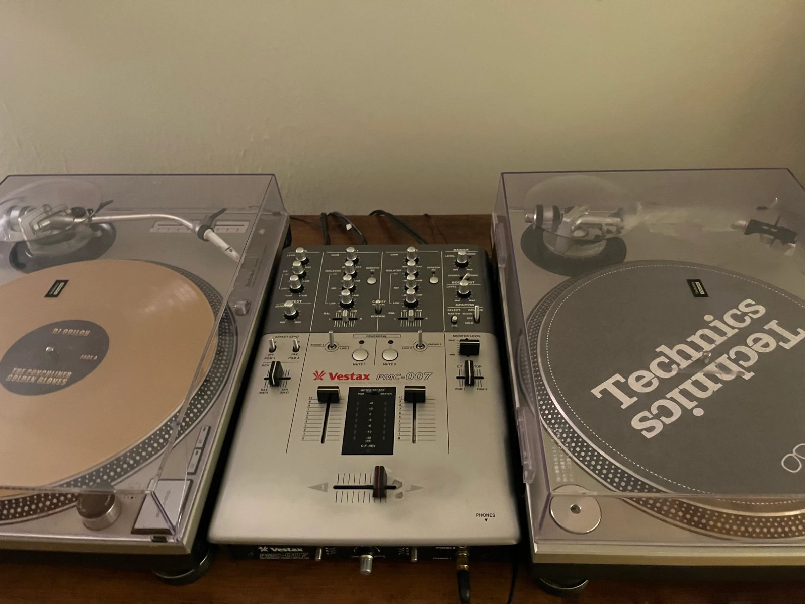

# Your first prediction

In this tutorial you load the published checkpoint, ask three questions about one photo (one of each type), and
read the answers. It takes a few minutes on a CPU, most of it downloading the weights once.

You need the package [installed](../install/overview.md). The photo is two turntables and a mixer:
[`example.jpg`](example.jpg). Save it next to your script.



## 1. Load the checkpoint

```python
import laya
from PIL import Image

agent = laya.load_vlm("thaitea/laya-vision")
```

## 2. Ask three typed questions

The first argument is the **state**: the image plus any text context as a dictionary. The second is the
**questions**, each with a `type`, `instructions` and, for `choice` and `score`, `criteria`.

```python
result = agent.predict(
    {"image": Image.open("example.jpg"), "note": "listing photo for a used DJ setup"},
    {
        "category":  {"type": "choice", "instructions": "What kind of item is this?",
                      "criteria": ["electronics", "clothing", "furniture", "food", "other"]},
        "record":    {"type": "noul", "instructions": "Is there a vinyl record on one of the turntables?"},
        "condition": {"type": "score", "instructions": "What condition is the equipment in?",
                      "criteria": ["poor: broken or missing parts", "fair: heavy wear", "good: light wear", "like new"]},
    },
)
```

All three questions are answered in one call. The image is encoded once and reused for every question; nothing is
generated.

## 3. Read the answers

`result["answers"]` has one entry per question. This is what the checkpoint returned, at Hub revision `8b318c9`
(the 201M checkpoint published 2026-09-24), on a CPU in float32. A later checkpoint gives different numbers; pin
one with `load_vlm(..., revision=...)`.

```json
{
  "category": {
    "type": "choice",
    "choice": "electronics",
    "probabilities": {"electronics": 0.8571, "clothing": 0.0285, "furniture": 0.0314, "food": 0.0276, "other": 0.0554},
    "confidence": 0.6261,
    "action": {"act_probability": 0.9796}
  },
  "record": {
    "type": "noul",
    "noul": 0.2924,
    "confidence": 0.7076,
    "action": {"act_probability": 0.9997}
  },
  "condition": {
    "type": "score",
    "score": 1.9767,
    "legend": {"0": "poor: broken or missing parts", "1": "fair: heavy wear", "2": "good: light wear", "3": "like new"},
    "probabilities": {"0": 0.1287, "1": 0.1946, "2": 0.2481, "3": 0.4286},
    "confidence": 0.0685,
    "action": {"act_probability": 1.0}
  }
}
```

- **`category`** (`choice`): `choice` is the most probable option, here `electronics` at 86%. The probabilities
  are over the options you listed and sum to 1.
- **`condition`** (`score`): `score` is the *expected* level, the probability-weighted average of the level
  indices, here 1.98, around "good". The probabilities show the model leaning to "like new" (43%) but spread over
  every level, and `confidence` (0.07, one minus the normalised entropy) says the same.
- **`record`** (`noul`): `noul` is P(true). Here it is **0.29**, and it is wrong: the left turntable holds a gold
  record. A probability is the model's belief, calibrated on its validation sets, not a guarantee; on your own
  photos, check a sample and [calibrate on your data](../how-to/calibrate.md) before acting on a threshold.

The rest of the result records what produced the numbers:

```python
result["usage"]       # {"input_tokens": 388, "output_tokens": 0, "images": 1}
result["provenance"]  # prompt format version, checkpoint and backbone revisions, dtype, device, library
                      # versions, a sha256 of every input id, and the temperature each question was divided by
```

## What you did

You ran a vision-language model as a classifier over options you wrote yourself, for three question types at
once, and read calibrated probabilities instead of generated text. Next:

- [Ask your own questions in the demo Space](space-demo.md).
- Every field and argument: [predict() and the answer schema](../reference/predict.md).
- Why an option can be read in one pass: [How it works](../concepts/how-it-works.md).
